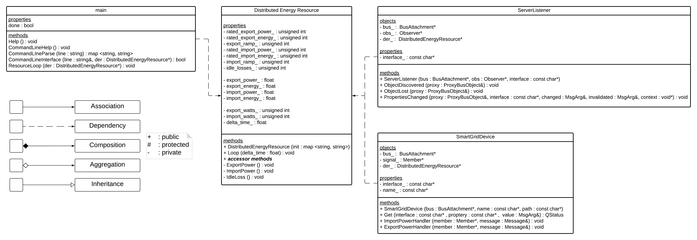

# DCS (Distributed Control System)

## Dependancies
### Linux Environment
``` console
sudo apt-get update
sudo apt-get upgrade
sudo apt-get install git build-essential gcc g++ cmake make xsltproc scons doxygen graphviz libgtk2.0-dev libssl-dev libxml2-dev libcap-dev
mkdir ~/dev ~/src
```

### AllJoyn
``` console
cd ~/src
git clone https://github.com/alljoyn/core-alljoyn

cd core-alljoyn
scons BINDINGS=cpp WS=off DOCS=html
```

#### Test AllJoyn Installation
``` console
export CPU=x86_64
export AJ_LIB=~/src/core-alljoyn/build/linux/$CPU/debug/dist/cpp/lib
export LD_LIBRARY_PATH=$AJ_LIB:$LD_LIBRARY_PATH

cd $AJ_LIB
cd ../bin/samples
./AboutService
```
If the BusAttachment/AboutObj succeed, then the installation should be fine.

## Install
``` console
cd ~/dev
git clone https://github.com/Tylores/DCS
```

### Setup
1. Open /DCS/tools/build-run.sh
2. Modify "CPU" to reflect the system you are working on
3. Ensure "AJ_ROOT" is correct

``` console
cd ~/dev/DCS/tools
./build-run.sh
```
## Use
The program can be controlled two ways:
1. The method handlers built into the "Smart Grid Device" that execute when an AllJoyn method call is recieved.
2. The Command Line Interface (CLI).

```
        [Help]
> q             quit
> h             help
> i <watts>     import power
> e <watts>     export power
> p             print properties
```

## Class UML

<p align="center">
  
</p>
